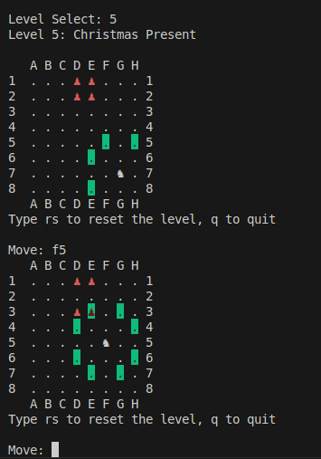
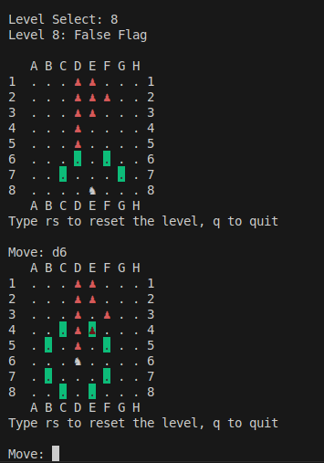
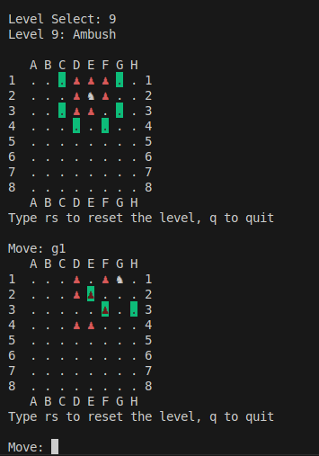

Logo generated with miniwi font from patorjk.com

# About

A quick & simple single-player chess puzzle game where you use a lone knight to clear the level of enemy pawns before they reach the 8th row of the board.

Each level takes less than a minute! Clear all 15 levels to complete the game.

# Usage

To play, open this folder in the terminal and input the command: 
    `python3 game.py`

# Screenshots

## Level 5: Christmas Present

## Level 8: False Flag

## Level 9: Ambush

# Gameplay

1. Use your knight to stop the pawns from reaching your backline (the 8th row). 
2. After you move, all enemy pawns will move forward unless there is a pawn or knight blocking it
3. Enemy pawns will not capture your knight.
4. All enemy pawns in row 1 will move first, then row 2, and so on. If there is a pawn in row A1 and A2, the pawn in A1 will be blocked from moving by the pawn in A2. 

## Levels 
0. Lone Star
1. Gemini
2. Conga Line
3. Birds of a Feather
4. Wall Climber
5. Christmas Present
6. Parallel Lives
7. Mercy
8. False Flag
9. Ambush
10. Free Will
11. Vendetta
12. Regiment
13. Forefathers
14. Cascade
15. Slice

# Solver

If you would like to create your own levels, you can input the starting positions of the pawns and the knight's starting position into `solver.py` to check if the level is solvable. To check if there is a solution output, input the command:
    `python3 solver.py`

# Requirements

You'll need to have Python 3 installed in your machine.